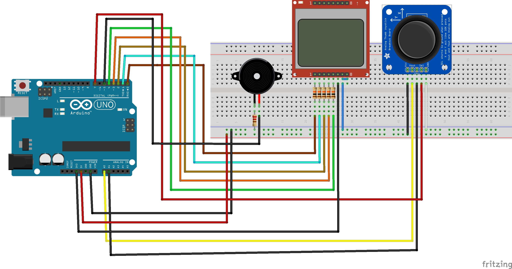

# snakeduino
 
Nokia 5110 display

<table>
<tr><td>Signal</td><td>pin</td></tr>
<tr><td>RST</td><td>0</td></tr>
<tr><td>CE</td><td>1</td></tr>
<tr><td>DC</td><td>2</td></tr>
<tr><td>DIN</td><td>3</td></tr>
<tr><td>CLK</td><td>4</td></tr>
<tr><td>VCC</td><td>3,3V</td></tr>
<tr><td>LIGHT</td><td>GND</td></tr>
<tr><td>GND</td><td>GND</td></tr>
</table>
Buzzer pin 5 
Joystick SW pin 7 
Joystick analog inputs A0, A1 

Required libraries: 
https://github.com/adafruit/Adafruit-PCD8544-Nokia-5110-LCD-library 
https://github.com/adafruit/Adafruit-GFX-Library
